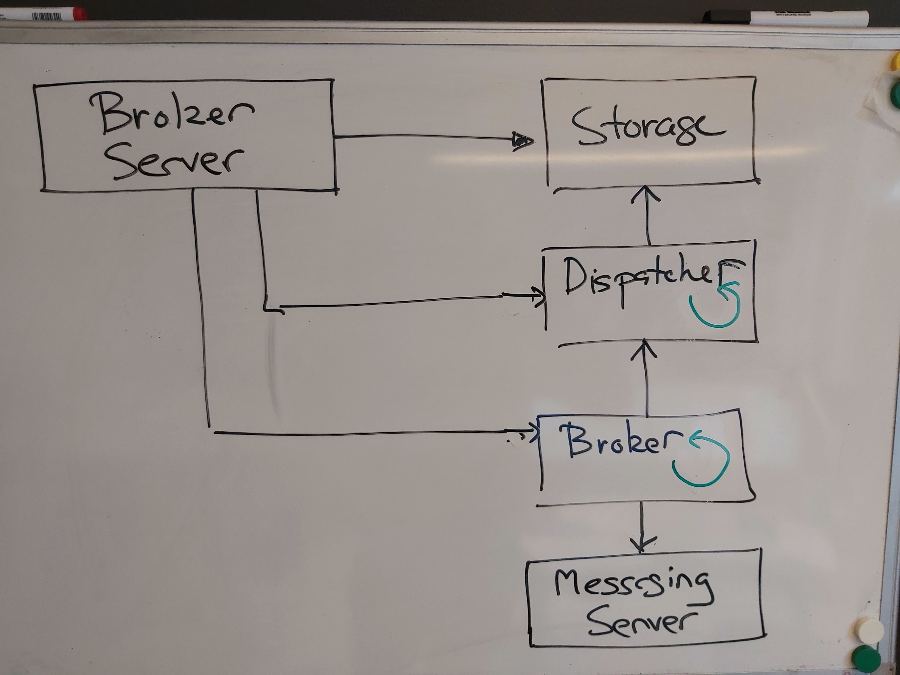

## DAT110 - Project 2: Publish-subscribe messaging middleware

### Organisation

This project work is to be undertaken in **groups of 2-4 students** - preferably the same groups as for project 1.

Discussions among the groups are allowed, but the code handed in by the group should be the work of the group members - and not members of other groups.

You are strongly encouraged to use the DAT110 Discord server throughout the project if you encounter issues or have questions related to the project.

The deadline for handing in the project can be found in Canvas.

### Overview

The aim of the project is to implement a publish-subscribe message-oriented middleware (PB-MOM) on top of the TCP-based messaging layer from project 1.

You are **not** required to implement the messaging transport layer - or use what you implemented in project 1, but you are given an implementation of it as part of the start code. There should not be any need to directly use TCP/UDP transport services and socket programming, only indirectly via the provided message transport service implementation.

You are assumed to have solid understanding of the material in Chapter 4 (Communication) in the distributed systems book, in particular be familiar with the concepts of publisher clients, subscriber clients, topics, and brokers. You are also assumed to be familiar with the service provided by the messaging transport layer that you implemented as part of project 1.

The figure below gives an overview of the PB-MOM that is to be implemented:

- The client-side of the PB-MOM consists of *publishers and subscribers* that can create/delete topics, subscribe/unsubscribe to *topics*, and *publish* messages to topics. When a publisher publishes a message on a given topic, then all currently connected clients subscribing to the topic is to receive the message.

- The server-side is comprised of a *Broker* that manages the connected clients (publishers and subscribers), topics and subscriptions, and which acts as an intermediate responsible for publishing messages to the subscribers of a given topic.  


The project is comprised of the following main tasks:

- **Task A.** Implement classes for the messages to be used in the publish-subscribe protocol between clients and the broker (server).

- **Task B.** Implement the *storage* of topics and subscriptions in the broker, and the *dispatcher* responsible for processing of publish-subscribe messages received from connected clients.

- **Task C.** Application of the PB-MOM for implementing a small IoT system in which a sensor (client) publishes the current temperature on a temperature topic to which a display (client) is subscribing (see also lab-exercises from earlier weeks and project 1).

- **Task D.** Experiment with PB-MOM for implementing the ChApp (Chat Social Network Application) where users can send short messages to each other via topics similar to what is found in many social network applications.

In addition, there are two optional - and more challenging task for those who interested in taking the project a bit further.

- **Task E.** Extend the broker such that if a subscribing client is currently disconnected and later reconnects, then the client will be provided with the messages that may have been published on the topic while the client was disconnected.

- **Task F.** Extend the broker from being single-threaded to being multi-threaded having a dispatcher thread for handling each connected client.

**Task E is most likely easier than Task F**

### Getting started - obtaining the start-code and the unit-test projects

#### Fork and Clone the start-code repository

One member of the group should start by entering the following repository on github:

https://github.com/lmkr/dat110-project2-mom-startcode

and choose *Use this template* of the repository (see button in the upper right of the repository web page).

This will create a "copy" of the start-code repository on the group members own github repository account.

In order for the other group members to work together on the same copy of the start-code, the other group members must be provided with access to read/write on the repository. See *Settings* and *Manage Access* for the repository.

All group members can now clone the repository and collaborate on the code.

The repository contains the start code organised into a [Maven](https://maven.apache.org/) project and can be imported into IDEs such as Eclipse and IntelliJ.

- Importing into Eclipse: Use `File -> Import -> Maven -> Existing Maven Projects` to import the startcode project
- Importing into IntelliJ: Use `File -> New -> Project From Existing Sources` to import the startcode project

The `src/main` folder contains the source code while the `src/test` folder contains a number of unit tests that can be used for some basic testing of the implemented functionality. These tests are by no means complete, and when running the test you should also check in the Eclipse console that no exceptions are raised when running the tests.

It should not be necessary to add additional classes in the start-code in order to complete the project. The unit-tests should not be modified as they will be used for evaluation of the submitted solution.

The code and tests can be compiled and run from the IDE or using maven commands with targets such as:

```
%>mvn compile
%>mvn test
```

It is also possible to execute the individual test classes by specifying the specific test-class to be executed. Below is an example of how to execute the tests in the `TestStorage`-class.

```
%> mvn test -Dtest=TestStorage 
```

### Task A: Publish-subscribe Protocol Messages

The messages to be exchanged between the clients and the broker is to be implemented as classes in the `no.hvl.dat110.messages` package.

The base message class is `Message.java` and all message classes must be subclasses of this class. All messages will contain information about a `user` and have a `type` as defined in `MessageType.java`. The `user` is assumed to uniquely identify a connected client.

The communication between the client and the broker is to be based on the message transport layer/service implemented as part of project 1. An implementation of this layer is provided a part of the start-code in the `no.hvl.dat110.messagetransport` package.

The `no.hvl.dat110.messages` package already contains classes implementing the following messages for the publish-subscribe protocol:

- `ConnectMsg.java` - sent by the client as the first message after having established the underlying message transport connection to the broker.

- `DisconnectMsg.java` - sent from the client in order to disconnect from the broker.

You are required to complete the implementation of the remaining message-classes.

- `CreateTopicMsg.java` - sent by the client in order to have the broker create a `topic`. A topic is to be identified by means of a `String`

- `DeleteTopicMsg.java` - sent by the client in order to have a `topic` deleted.

- `SubscribeMsg.java` - sent by the client in order to subscribe to a `topic`.

- `UnsubscribeMsg.java` - sent by the client in order to unsubscribe from a `topic`.

- `PublishMsg.java` - sent by the client in order to publish a `message` (`String`) on a topic and sent by the broker in order to deliver the message to subscribed clients.

You must determine by considering the role of the message what object variables are needed in the classes, i.e., what information the given message need to contain.  The message-classes must have a constructor that can give a value to all object-variables, getter/setter methods for all object-variables, and they must implement a `toString`-method to be used for logging purposes.

There are no tests available for testing your implementation of the message-classes, but the classes will be tested as part of the tests in Task B below.

### Task B: Broker Implementation

The figure below gives an overview of the implementation of the broker server. The `Broker` uses an underlying `MessagingServer` (from the messaging layer) to accept new message connections from clients. It then hands-off these connections to the `Dispatcher` which is responsible for processing incoming messages on the connections using the information stored in the `Storage`.



The implementation of the broker can be found in the `no.hvl.dat110.broker` package. You will have to study the code of the broker which is comprised of the following classes

- `ClientSesssion.java` which used to represent a *session* with a currently connected client on the broker side. Whenever a client (user) connects, a corresponding `ClientSession`-object will be created on the broker-side representing the underlying message transport connection. The methods in this class must be used when the broker is to receive and send messages to a connected client.

- `Storage.java` which is to implement the storage of currently connected clients and manage the subscription of clients (users) to topics. **You will complete the implementation of this class in Task B.1 below.**

- `BrokerServer.java` which contains the `main`-method of the broker. It is responsible for starting up the server and creating the storage and dispatcher of the broker.

- `Broker.java` implementing a `Stopable`-thread abstraction. The `doProcess`-methods of the broker runs in a loop accepting incoming message transport connections (sessions) from clients.

- `Dispatcher.java` implementing a `Stopable`-thread that is responsible for processing the messages received from clients. The `doProcess()`-methods of the dispatcher in turn checks (polls) the client sessions for incoming messages and then invokes the `dispatcher`-method which, depending on the type of received message, will invoke the corresponding handler method. **You will complete the implementation of the dispatcher in Task B.2 below.**

Both the *Broker* and the *Dispatcher* runs as Stopable-threads as implemented by the Stopable-class in `Stopable.java`:

```java
public abstract class Stopable extends Thread {

	private boolean stop = false;
	protected String name;

	public Stopable(String name) {
		this.name = name;
	}

	public synchronized void doStop() {
		stop = true;
	}

	private synchronized boolean doCont() {
		return !stop;
	}

	public abstract void doProcess();

	public void run() {

		Logger.log(name + " running");

		while (doCont()) {
			doProcess();		
		}

		Logger.log(name + " stopping");

	}
}
```
The classes `StopableExample.java` and `StopableExampleMain.java` in the `no.hvl.dat110.common` package contains an example of use of Stopable-thread abstraction.

#### Task B.1 Broker Storage

The class `Storage.java` of the broker implements an in-memory storage where the broker can store information about connected clients and the subscription of user (clients) to topics. The start of the class is already provided:

```java
public class Storage {

	private ConcurrentHashMap<String, Set<String>> subscriptions;
	private ConcurrentHashMap<String, ClientSession> clients;

	public Storage() {
		subscriptions = new ConcurrentHashMap<String, Set<String>>();
		clients = new ConcurrentHashMap<String, ClientSession>();
	}
 [...]
```

The basic idea is to use a hash-map mapping from topics (`String`) to a set of users (`String`) for managing which users are subscribed to which topics. Similarly, the currently connected clients are stored in a hash-map mapping from a user (`String`) to a `ClientSession`-object representing the connection/session with the client.

The broker data model for the storage is illustrated below


You are required to complete the implementation of the following methods in the `Storage.java` class:

- `public void addClientSession(String user, Connection connection)`

- `public void removeClientSession(String user)`

- `public void createTopic(String topic)`

- `public void deleteTopic(String topic)`

- `public void addSubscriber(String user, String topic)`

- `public void removeSubscriber(String user, String topic)`

- `public Set<String> getSubscribers(String topic)`

The TODO-comments in `Storage.java` class provides more detailed information about what the individual methods are supposed to do.

**Hint:** to obtain an empty set of subscribers when creating a new topic you can use the method `ConcurrentHashMap.newKeySet()`.

Note that both users and topics are identified using `String` which is not strogly typse safe, and hence you need to be careful not to use a user as topic (or vice versa) when passing arguments to constructors and methods.

The package `no.hvl.dat110.broker.storage.tests` in the `dat110-prosject2-testing` project contains some basic unit tests that can be used to test the implementation of the storage methods.

#### Task B.2 Broker Dispatcher for Message Processing

All communication between the broker and the connected clients will be done via the `send`, `receive`, and `hasData`-methods of the corresponding `ClientSession`-object. The encapsulation of the underlying message transport connection has been already implemented in the `ClienSession.java` class.

The messages exchanged between the broker and the client will be a JSON-representation of the objects of the message-classes implemented in Task A.  As an example, a `ConnectMsg`-object will be represented as follows:

```java
{"type":"CONNECT","user":"testuser"}
```

The conversion to/from the JSON format has already been implemented using the [gson-library](https://github.com/google/gson) library in the `MessageUtils.java` class.

The aim of this task it to implement the broker-side processing of the messages received from clients in the `Dispatcher.java` class. The `doProcess`-method of the dispatcher runs in a loop where it in turn checks the current client sessions for an incoming message using the `hasData`-method. If the client has sent a message, then it will invoke the `dispatch`-method which in turn will invoke a method named on the form `onX` for a processing a message of type `X`.

The dispatcher already contains an implementation of the `onConnect` and on `onDisconnect`-methods. Your task is to complete the implementation of the remaining methods in [Dispatcher.java](https://github.com/selabhvl/dat110-project2-startcode/blob/master/src/no/hvl/dat110/broker/Dispatcher.java)

- `public void onCreateTopic(CreateTopicMsg msg)`

- `public void onDeleteTopic(DeleteTopicMsg msg)`

- `public void onSubscribe(SubscribeMsg msg)`

- `public void onUnsubscribe(UnsubscribeMsg msg)`

- `public void onPublish(PublishMsg msg)`

in order to be able to also process the remaining types of messages.

The tests found in the `no.hvl.dat110.broker.processing.tests` package can be used to test the implemented methods.

**IMPORTANT NOTE:** The tests in the `no.hvl.dat110.broker.processing.tests` package, i.e., Test1, Test2, ... ,Test7 will have to be run one at a time as they are using the same TCP/IP port for the broker.

### Task C: IoT sensor-display application

In this task you will use the PB-MOM middleware to implement a small IoT system comprised of a (temperature) sensor, and a display.

The start of the implementation of the IoT-system can be found in the `no.hvl.dat110.iotsystem` package.

The class `Client.java` in the `no.hvl.dat110.client` package contains an implementation of the methods needed for implementing the sensor and display clients that can connect to the broker.

The class `Common.java` contains the port number that can be used for connecting clients to the broker server.

The principle of the sensor-display application is shown below


**IMPORTANT NOTE:** the sensor and the display will be clients (and users) and you can for instance use `"display"` and `"sensor"` as the user names.

#### Sensor device implementation

The skeleton of the sensor device implementation can be found in the `TemperatureDevice.java` class.

You are required to complete the implementation such that the sensor device connects to a broker, runs in a loop `COUNT`-times where it publishes to a *temperature* topic. After that the sensor device should disconnect from the broker.

#### Display device implementation

The skeleton of the display device implementation can be found in the `DisplayDevice.java` class.

You are required to complete the implementation of the display device such that it connects to the same broker as the sensor device, creates a *temperature* topic, subscribes to this topic and then receives the same number of messages as the sensor device is sending on the topic. Upon completion, the display device should disconnect from the broker.

#### Testing the IoT sensor-testing system

Try to start a broker and have the display device and then the sensor device connects. Check that the display device is correctly receiving the temperature-messages published by the sensor device.

The test in the package `no.hvl.dat110.iotsystem.tests` can be used to run the IoT system. When running the test you should see output similar to:

```
IoT system starting ...
Starting broker ...
Broker server : 8080
Dispatcher running
.Broker running
Broker accept [0]
....Starting display ...
Display starting ...
.!0
?
Message [type=CONNECT, user=display]
onConnect:Message [type=CONNECT, user=display]
Client sessions:1
Broker accept [0]
.?
CreateTopicMsg [topic=temperature]Message [type=CREATETOPIC, user=display]
onCreateTopic:CreateTopicMsg [topic=temperature]Message [type=CREATETOPIC, user=display]
Topic : 1
.?
SubscribeMsg [topic=temperature]Message [type=SUBSCRIBE, user=display]
onSubscribe:SubscribeMsg [topic=temperature]Message [type=SUBSCRIBE, user=display]
Subscribers : temperature : 1
..Starting sensor ...
temperature device started
!0
?
READING: 2
Message [type=CONNECT, user=temperaturesensor]
onConnect:Message [type=CONNECT, user=temperaturesensor]
Client sessions:2
Broker accept [0]
.?
PublishMsg [topic=temperature, message=2]Message [type=PUBLISH, user=temperaturesensor]
onPublish:PublishMsg [topic=temperature, message=2]Message [type=PUBLISH, user=temperaturesensor]
DISPLAY: 2
....READING: 20
.?

[ ... ]

.Display stopping ...
.?
UnsubscribeMsg [topic=temperature]Message [type=UNSUBSCRIBE, user=display]
onUnsubscribe:UnsubscribeMsg [topic=temperature]Message [type=UNSUBSCRIBE, user=display]
Subscribers : temperature : 0
.?
Message [type=DISCONNECT, user=display]
onDisconnect:Message [type=DISCONNECT, user=display]
Client sessions:1
.Temperature device stopping ...
IoT system stopping ...
```

### Task D: ChApp - Chat social network  application

The purpose of this task is to connect multiple JavaFX-based GUI clients to a broker, and in this way implement a short messaging system.  The key point is to demonstrate how the publish-subscribe middleware implemented in tasks A and B can be used for very different applications.

The architecture of the chat application system is shown below.


The figure below show a screenshot of the client GUI. The chat application client makes it possible to connect to a broker, create/delete topics, subscribe/unsubscribe to topics, and to publish messages on topics.


A video-demonstration of the application can be found here: https://www.youtube.com/watch?v=qGibmzlm0x0&feature=youtu.be

#### Task D.1 Compile and build the Chat application

In this task you are not to implement anything, but only do an experiment with the chat-application.

You can run the chat-application by cloning this repository:

https://github.com/lmkr/dat110-project2-javafx-chatapp

and then build and execute the application using maven:

```
mvn clean javafx:run
```

#### Task D.2 Running the Chat application

Start by testing the system by running the broker and two clients on the same machine. The broker will run on the TCP/IP port specified in the class BrokerServer.java and you start the broker server by running the main-method in this class. Try creating topics and then publish some messages.

Next, start a broker on one machine and let each group member run the ChApp-client on their machine. Remember to use the Configure menu-item in the chat application to correctly set the IP address and port number of the broker.

If you are not able to connect to the broker it may be due to firewall issues on the host running the broker or the client. Make sure that the port on which the broker is running is not blocked by the firewall.

### Task E: Message Buffering (optional)

When a client disconnects from the broker, the corresponding `ClientSession-object` is removed from the storage. This means that if the client is subscribing to a topic and messages are published on that topic while the client is disconnected, then the client will not receive the published messages. If the client later reconnects, it will only receive those message that were published after the reconnect.

The aim of this task is to extend the implementation of the broker such that the broker will buffer any messages for a subscribed client until the point where the client connects again. At that point, the broker should then publish the buffered message to the client. Implementing this extension will involve  

- Augmenting the broker storage such that buffering of messages for the clients becomes possible. **Hint:** you will need an additional hash-map in Storage.java to store a set of messages for a user that is currently disconnected.
- Changing the implementation of how a connect from a client is handled by the dispatcher. **Hint:** you will have to send any buffered messages to the connecting client.  
- Changing the implementation of how a publish-message from the client is processed by the dispatcher. **Hint:** if a subscribing client is currently disconnected (does not have a session), then the message will have to be buffered.

You may use the ChApp-application or a revised version of the IoT-system to test the buffering implementation; or alternatively write a unit test similar to the ones found in the `no.hvl.dat110.broker.processing.tests` package to create a scenario where a client (subscriber) disconnects for a while and then reconnects.

### Task F: Multi-threaded Broker (optional)

The implementation of the dispatcher in the `Dispatcher.java` class runs as a single `Stopable`-thread which in turn checks the current client sessions for incoming messages using the `hasData`-method. This means that it is not possible to exploit multiple-cores when running the broker, and this may degrade the performance of the broker as perceived by the clients.

The aim of this task is to change the implementation of the dispatcher such that each client session has an associated thread which processes the incoming message from the corresponding client.

Addressing this task involves:

- Creating a new dispatcher-thread in the broker whenever a client connects, i.e., when the `waitConnect`-method in the broker is executed.
- Revise the implementation such that a dispatcher thread will then wait for incoming messages from the client and handle these accordingly (as before). This means that the doProcess-methods of the dispatcher no longer should iterative across all client-sessions since each dispatcher-thread handles on client.
- Revise the implementation such that when a client disconnects, i.e, the `onDisconnect`-methods in the dispatcher is invoked, then the corresponding dispatcher thread should be terminated using `doStop()`

It should also be possible to stop/terminate the execution of all current dispatcher-threads. In the current implementation, the single threaded dispatcher can be stopped by invoking the `doStop`-method on the dispatcher.

### Summary

The figure below summarises the implementation with the red boxes indicating classes where you have to write code in order to complete the tasks of the project.


### Handing in the project

1. When the group is ready to hand-in, a **tagged commit** must be pushed to github in order to trigger an action which compiles the solution and runs all test on github. This is done using the following git commands - where *X* is to be replaced by a number:

```
%> git tag handinX
%> git push origin handinX
```

If you for some reason need to hand in again, then *X* will have to be a new number. **Note** it is no problem to push changes multiple times, but the github action is only triggered when you push a specific tag. You can go to your repository on github and check the result of executing the action by selecting the *Actions* tab as shown in the figure below.

2. The group must hand in a **link** on Canvas to the git-repository containing their implementation AND a screenshot showing the chat application in use. **Remember** to hand-in as a group as described in the guide available on Canvas.

3. The group must provide **read access** to their solution repository to the lab-assistent. The usernames of the lab-assistants are available via Canvas.

